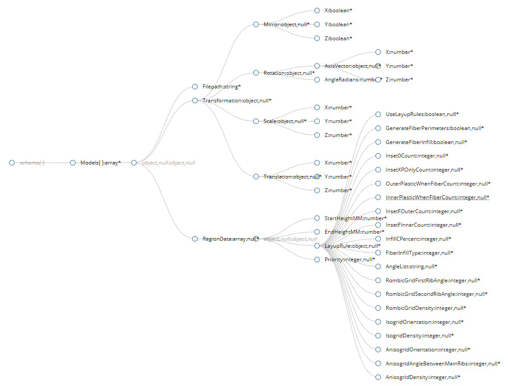

#Aura CLI

##Usage
Process g-code for model:
    aura.cli --center --models part.stl --output part.gcode --session settings.aus
Process g-code for several models:
    aura.cli --models part.stl part2.stp --output part.gcode --session settings.aus
Process g-code with custom layup rules for parts:
    aura.cli --input parts-data.json --output part.gcode --session settings.aus

Use *Tools->Export session...* in Aura to save session file with current slicing settings.

##Parameters
-m, --models     (Group: parts) Model files to slice, several filenames should be separated by spaces. Models shouldn't intersect.
-i, --input      (Group: parts) Input data file with information about models and layups in JSON format.
-s, --session    Required. Session file with slicing settings in JSON format.
-o, --output     Required. Output file.
-c, --center     In case of single part put it to the center of the buildplate.
-f, --force      Overwrite existing output file.
--help           Display this help screen.
--version        Display version information.

##Json input format
You can specify a list of models with layup regions and transformations using *--input* parameter.
The JSON Schema for the input file can be found in *cli-inputfile.schema.json*, which is located in the Aura program directory.
