# GUI overview

This document will show and explain all parts of the user interface offered by Aura.Connect

## Login

The very first part of the user interface that every new user of Aura.Connect will see is the [Login](#login) screen

Although this UI element may be self explanitory, let's still go through its main parts 

### Sign in

The sign in screen allows you to perform authentication using your Aura.Connect credentials

In order to authenticate enter your email in the first field and your password in the second field, then click the **'Sign In'** button

### Forgot password

On the [Sign in](#sign-in) screen, there is the **'Forgot password'** button, which brings you to the forgot password screen, which looks like this

Here you will be able to reset your password, if you happen to forget it. All you need to do is enter your email in the field, then click the **'Send'** button

Shortly after you will receive a password recovery code on your email, which you can use to set a new password for your account in Aura.Connect

::: warning
Password recovery codes can expire. If your recovery code has expired, you can request a new one by following instruction above
:::

## Navbar

The static upper part of Aura.Connect is called a [Navbar](#navbar). Here you will be able to see your accounts' email, and logout.

### Logout

In order to logout click the **'Logout'** button, which is located after your email in the [Navbar](#navbar)

## Sidebar

The static left hand side part of Aura.Connect is called a [Sidebar](#sidebar). It contains all of the sections of Aura.Connect, which are available to your account

::: tip
Different account types in Aura.Connect have different section of Aura.Connect available to them. See [Account types]() for more information
:::

Let's go over each of the sections in more detail below

## Dashboard

Navigate to the [Dashboard](#dashboard) screen by clicking the **'Dashboard'** button located in the [Sidebar](#sidebar)

The dashboard section is often used as a quick summary of your company's statistics and for monitoring the current state of your printers. 

Dashboard is split into three main parts, listed below

### Printer summary

Shows the current state of printers added to your company is Aura.Connect. There are 3 groups the printers are split into, they include:

1. Finished
    - Shows all the printers that have finished printing and need a confirmation from the user on their screen
2. In progress
    - Shows all the printer that are currently printing
    - For each printing printer you will see
        1. G-Code file name, that's currently being printer
        2. Overall printing progress in percents, ranging from 0% to 100%
        3. Current tool being used by the printer, and that tools' temperature
3. Errors
    - Shows all the printes that have unacknowledged errors, and the last error that the printer has sent out

### Printer telemetry summary

Is consisted of printer cards, each printer card shows:

1. Telemetry data over the last 5 minutes (for connected printers only)
2. Printer state in the upper right corner 
3. Printer name
4. Printer model

::: tip
You can hover your mouse cursor over the plotting area in order to study telemetry data in more detail
:::

### Company statistics summary

Shows a quick summary of statistics in your company. These statistics include:

1. Statistics for a period
    1. Jobs finished
    2. Print hours
    3. Material consumptions for each material

2. Statistics overall
    1. Printing hours by weekday
    2. Jobs by user

Additionally, you can queue a new printing job using the [Job queue wizard]() by clicking the **'Queue new job'** button

> If you haven't added any printers in Aura.Connect yet, you will see a **'Add new machine'** button instead of the **'Queue new job'** button

## Company

Navigate to the [Company](#company) screen by clicking the **'Company'** button located in the [Sidebar](#sidebar)

The company section contains information about all the users in the company. If you're a company admin you are also able to change information about the company, add new users, add other users to company admins.

This section is split into three main parts listed below

### Info panel

In the upper left part you will see the [Info](#info-panel) panel

Here you will see your company's country and address 

### Users panel

In the lower left part you will see the [Users](#users-panel) panel

Here you will see a list of all users registered in your company

Hover over a user and click on the trash icon on the right in order to remove a user from your company

### Admins panel

In the upper right part you will see the [Admins](#admins-panel) panel

Here you will see a list of all users which have been made admins in your company

Hover over a user and click on the trash icon on the right in order to deprive them of admin rights in your company

### Company info form

In order to edit company information press the **'Edit'** button in the [Info](#info-panel) panel, a form on the right will appear

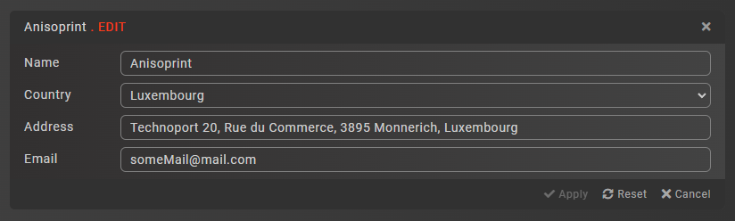

Press the **'Apply'** button after you've finished editing your company's information, this will save all of your changes to Aura.Connect

Press the **'Reset'** button if you wish to revert all the changes made to your company's information

Press the **'Cancel'** button or a close button in the top right corner of the form to close the form  

### Add user form

In order to add a new user to your copmpany press the **'Register new user'** button in the [Users](#users-panel), a form on the right will appear

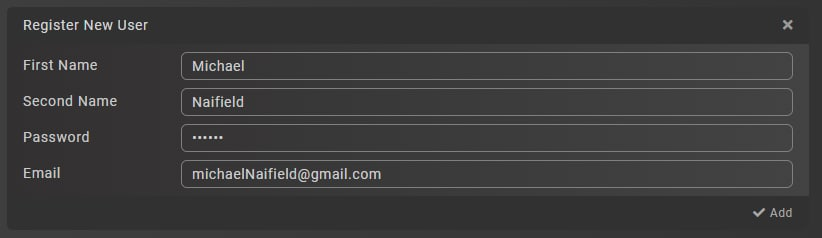

Press the **'Add'** button after you've entered all the necesary user information to add a new user to your company

Press the close button in the top right corner of the form to close the form

### Add admin dialog

In order to add a new admin to your company press the **'Add'** button in the [Admins](#admins-panel) panel, a dialog will appear

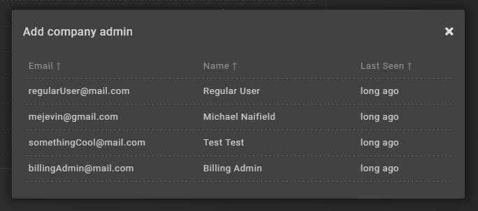

Click on the user you want to make an admin to make them your company's admin

## Library

Navigate to the [Library](#library) screen by clicking the **'Library'** button located in the [Sidebar](#sidebar)

The library section contains all the files uploaded to Aura.Connect by your company. You can also group your files into categories, upload new files, delete uploaded files.

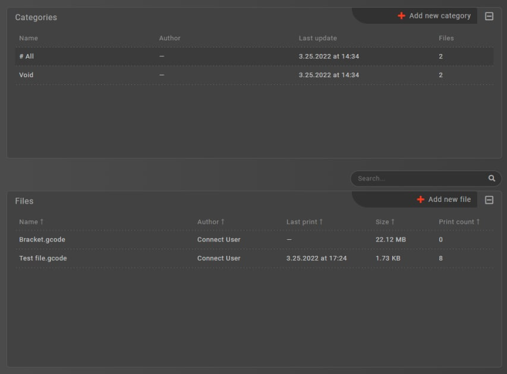

### Categories panel

In the upper left part you will see the [Categories](#categories-panel) panel

Here you will see a list of all categories added by users of your company

Hover over a category and click on the trash icon on the right in order to remove a category

Click on a category to filter the files by the selected category

::: tip
There are two categories, which you cannot delete:

1. **#All** - shows all files
2. **Void** - show files with no category
:::

### Files panel

In the lower left part you will see the [Files](#files-panel) panel

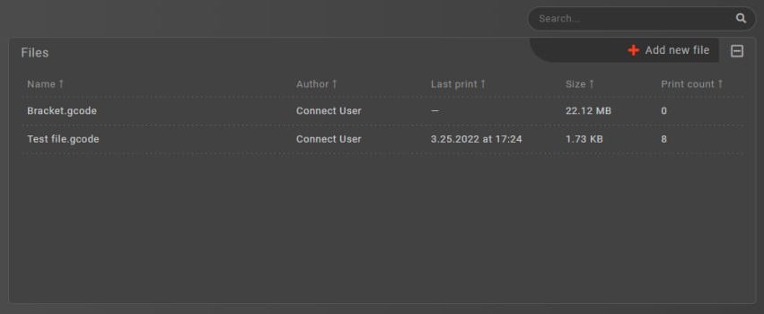

Here you will see a list of all files uploaded to Aura.Connect by users of your company

Hover over a file and click on the trash icon on the right in order to remove the file

Click on a file in order to inspect it

::: tip
Use the search box if you have many files. The search is performed by the file's name
:::
### Add category form

Click on the **'Add new category'** button in the [Categories](#categories-panel) panel in order to add a new category, a form on the right will appear

Enter the name of a new category and click the **'Add'** button. A new category will appear in the [Categories](#categories-panel) panel list. This category can now be used when uploading new files, or you can change the category of already existing files to it

### Add file form

Click on the **'Add new file'** button in the [Files](#files-panel) panel in order to add a new file, a form on the right will appear

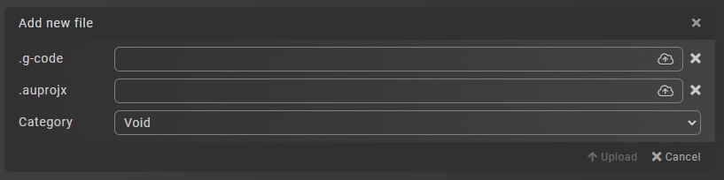

Drag and drop the desired .gcode file, and, optionally .auprojx, files, select a category and click the **'Upload'** button

::: tip
You can also click on the cloud icon in order to browse for files on your PC
:::

### File inspector

Click on the file in the [Files](#files-panel) panel in order to inspect a file, a [File inspector](#file-inspector) will appear on the right side of the screen

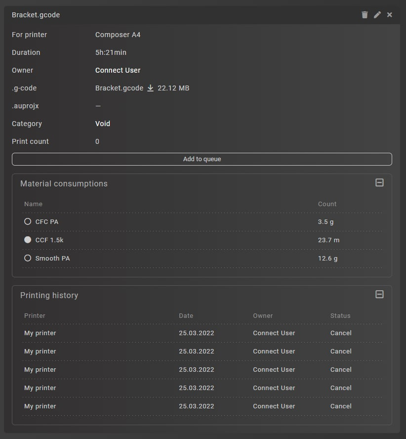

You will see all the information about a file, which is stored in Aura.Connect, including:

1. Printer model, for which the file is designed for
2. Duration for print
3. User, who added the file
4. .gcode file
5. .auprojx file
6. Category of the file
7. Print count

::: tip
Only successfully finished prints increment the print count
:::

The following actions may be performed in the [File inspector](#file-inspector):

1. Delete the file by clicking on the trash icon in the top right
2. Edit the file by clicking on the pen icon in the top right
3. Add the file to a queue to the desired printer via the [Printer selection dialog]()

When editing a file, you can change its .gcode, .auprojx files and its category by drag and dropping the files from your PC, or by clicking on the cloud icon.

## Machines

Navigate to the [Machines](#machines) screen by clicking the **'Machines'** button located in the [Sidebar](#sidebar)

The machines section contains all the printers added to your company, each of the printers can be viewed via the [Printer inspector](#printer-inspector)

### Printer list

In the left part of the [Machines](#machines) screen you will see a list of all printers added by your company in Aura.Connect

The [Printer cards](#printer-list) contain the following information about the printer:

1. Printer model
2. Printer name
3. Status of the printer
4. Error count on the printer

### Printer inspector

Click on one of the [Printer cards](#printer-list) in the [Printer list](#printer-list) in order to inspect the printer, a [Printer inspector](#printer-inspector) will open

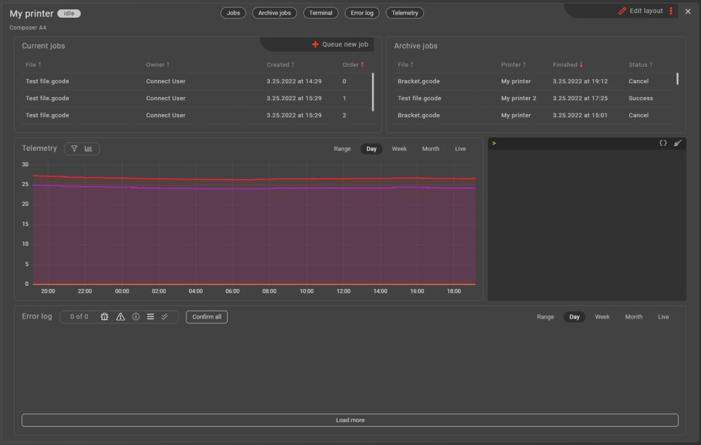

You will see a panel, that contains all of the information and interactive controls related to a printer. To be more specific, you will see the following controls:

#### Current jobs (informational & interactive control)

Shows all the jobs that are currently queued onto the selected printer

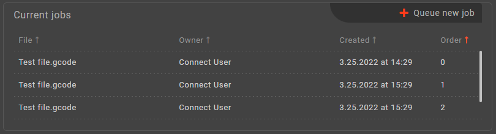

You can click on one of the jobs to view it in the [Jobs](#jobs) section

#### Archive jobs (informational control)

Show all the jobs archives that are available on the selected printer

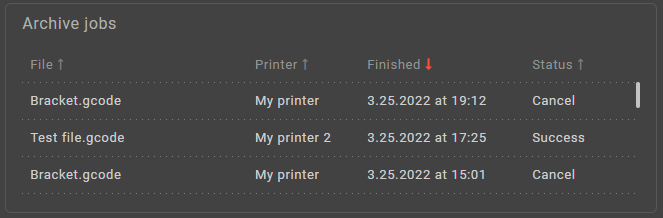

You can click on one of the archives to view it in the [Jobs](#jobs) section

#### Telemetry (informational control)

Shows the telemetry on the selected printer

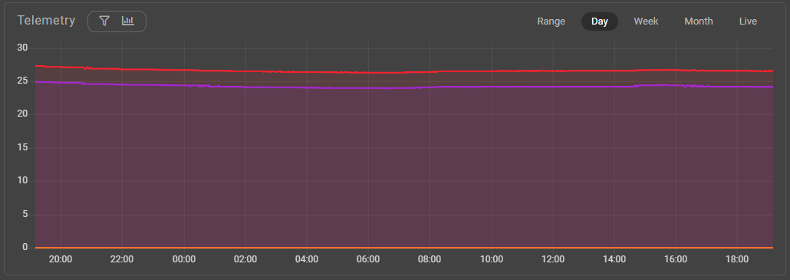

Change the period for which you're viewing the telemetry [1], and filter the telemetry by types and subtypes [2]

::: tip
If you can't see the fitering switches, use the toggle buttons next to the **'Telemetry'** title in the top left corner to toggle the visiblity of the filtering switches 
:::

#### Error log (informational control)

Show the different errors, warnings, and informational messages sent by a printer.

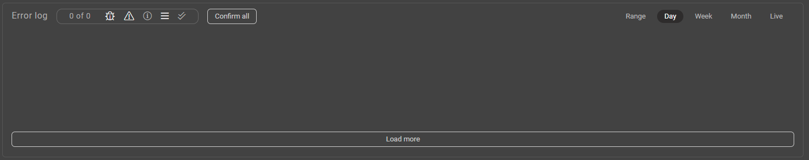

#### Terminal (interactive control)

Is used to send commands and view raw logs from the printer.

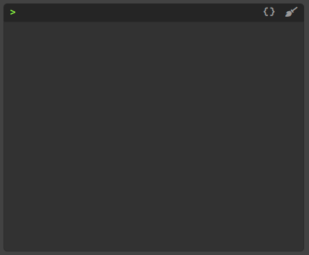

Type the command in the text field, and press **'Enter'** to send a command 

### Customize printer inspector

[Printer inspector's](#printer-inspector) layout may be customized. You can hide certain controls, resize them, move them, swap them (if they're the same size).

Press the **'Edit layout'** button in the top right of the [Printer inspector](#printer-inspector) to enter the layout editing mode

After you're finished changing the layout, press the **'Save layout'** button

Also, at the top, you will see buttons, which control the visibiity of certain controls. Toggle them on and off as you desire.

::: tip
If you've really messed up the layout, resetting it is a quick and easy way to get a usable layout. Reset it by clicking the **'Reset view'** button in the [Additional printer inspector actions](#additional-printer-inspector-actions) menu
:::

#### Additional printer inspector actions

Additionally, you can click the three dots button in the top right of the [Printer inspector](#printer-inspector) to:

1. Update connection with the printer
2. Delete printer
3. Edit printer's name
4. Reset view

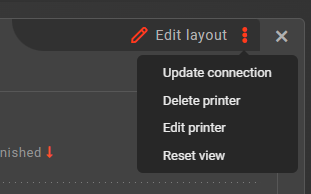

::: warning
Only admins of your company may delete printers 
:::

### Printer info form

Click the **'Edit printer'** button in the [Additional printer inspector actions](#additional-printer-inspector-actions) menu, a form in the bottom right corner of the [Machines](#machines) screen will appear

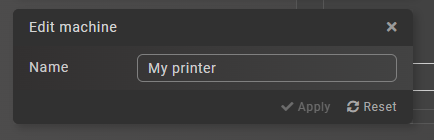

Here you can change the name of the printer

### Add new printer

::: warning
Only admins of your company may add new printer
:::

Click the **'Add new machine'** button at the top of the [Printer list](#printer-list), a form in the bottom right corner of the [Machines](#machines) screen will appear

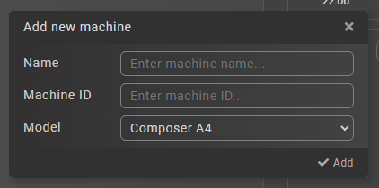

Here you can add a new printer to your company, by entering the name, selecting the model, and the *Machine ID* of the printer you're trying to add. After you've entered all the information, click the **'Add'** button and wait for the form to expand with the newly generated connection code for the printer

Use the code provided to you to connet to the newly added printer

> Refer to the [Establishing a connection]() article for more information

## Jobs

Navigate to the [Jobs](#jobs) screen by clicking the **'Jobs'** button located in the [Sidebar](#sidebar)

The jobs section contains all of the jobs queued onto printers in your company. Here you may inspect the jobs, monitor their progress, delete, reorder, start, stop, and pause them.

There are two tabs available in this screen

1. Current
    - Shows all the jobs that are currently available to interact with
2. Archive
    - Shows all the arhives created from jobs that were finished or cancelled

Switch between tabs, by clicking the buttons located in the upper right corner of the screen

### Job cards

In the **Current** tab, in the upper left part you will see [Job cards](#job-cards) for each job queued by your company

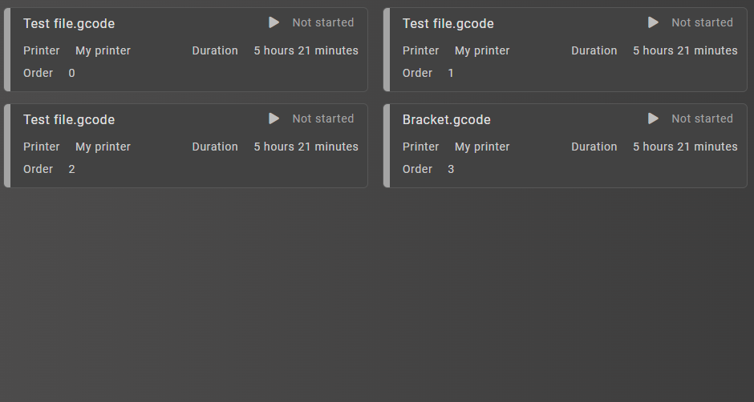

Each card has the following information:

1. Printer name (for which it is queued)
2. Order on the printer (each printer has its own queue)
3. Duration, if available
4. Progress, if the job is started
5. Estimated time of finish, if the job is started
6. Job status in the upper right corner

Additionally, next to the **Job status**, you will see buttons which control the state of the job. Use these buttons to:

1. Start the job
2. Pause the job
3. Stop the job

### Job inspector

Click on one of the [Job cards](#job-cards) to inspect the job in more detail, a [Job inspector](#job-inspector) will appear on the right side of the screen 

Here you will see all the information about a job, including:

1. Name of .gcode file contained in the file attached to a job
2. Status of the job
3. Source
    - A file attached to a job, which contains .gcode that is going to be printed
4. Printer
    - A printer, to which the job has been assigned to
5. Owner
    - A user, which cread the job
6. Order
    - Order of the job on a particular printer
7. Material consumptions
    - Calculated consumptions of different materials in grams for plastic and in meters for fiber

Additionally, in the upper right corner you can:

1. Start the job
2. Pause the job
3. Stop the job
4. Delete the job

::: tip
Use the arrow buttons to change the order of the job on the printer
:::

### Job timeline

In the lower part of the [Jobs](#jobs) screen you will see a timeline with all jobs queued for different printers

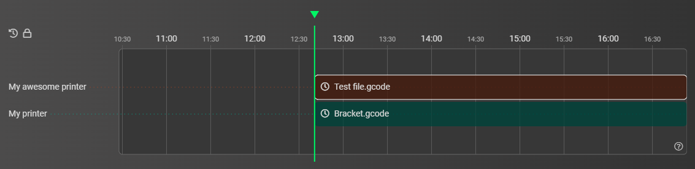

Here you will see the jobs that were queued onto printers in the order, that has been assigned to them. If a job has a known duration time, it will be displayed correctly chronologically. If the job's duration is not available it will be displayed as a fading rectangle.

Move along the timeline by holding down the left mouse button and moving your mouse. 

Zoom in and out on the timeline using the mousewheel

Select a job on the timeline by left clicking on it. This will open the job in the [Job inspector](#job-inspector)

Use the buttons in the top right part of the timeline to:

1. Lock the timeline
    - Locks the timeline and follows the current time (greeen line) automatically
2. Reset the timeline
    - Resets the zoom and position on the timeline to the default value

### Queue a new job

Press the **'Queue new job'** button in the upper left part of the [Jobs](#jobs) screen white on the **'Current'** tab, this will open a [Job queue wizard](#queue-a-new-job) dialog. This dialog has two steps, which you have to complete in order to queue a job, these steps are described below

#### Selecting a printer for a new job

First, you need to select a printer to which this job will be assigned. Do so by clicking on the printer in the list. 

After the printer is selected the **'Next'** button will become available, click it to go to the next step.

#### Selecting a file for a new job

After you've successfully selected a printer, you will be prompted to select a file, which contains the .gcode you want to print in the new job. Select the desired file by clicking on it.

After the file is selected the **'Confirm'** button will become avaialble. Click it and the job will now be queued on the printer you selected with the selected file

### Filter jobs by printer

In the upper middle part of the [Jobs](#jobs) screen, you will see toggle buttons, that allow you to filter the jobs that are displayed by printers

Switch them on and off by clicking on them, if you wish to see jobs for certain printers only

### Archives panel

In the left part of the [Jobs](#jobs) screen, while in the **'Archives'** tab, you will see the [Archives](#archives-panel) panel

Here you will see a list of all finished jobs in your company. We also refer to them as **Job archives**

### Archive inspector

Click on one of the job archives in the [Archives](#archives-panel) panel in order to inspect them, an [Archive inspector](#archive-inspector) will appear on the right side

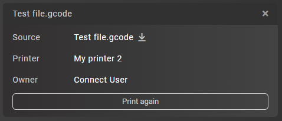

Here you will see the following information:

1. .gcode file name, that was being priting
2. Source
    - A file that has been upload to Aura.Connect and is available in the [Library](#library)
3. Printer
    - The printer that has been printing the job, which if avaialble in the [Machiens](#machines) section
4. Owner
    - The user who has created the job

Additionally, you can press the **'Print again'** button to queue the same file onto the same printer

## Profile

Navigate to the [Profile](#profile) screen by clicking the **'Profile'** button located in the [Sidebar](#sidebar)