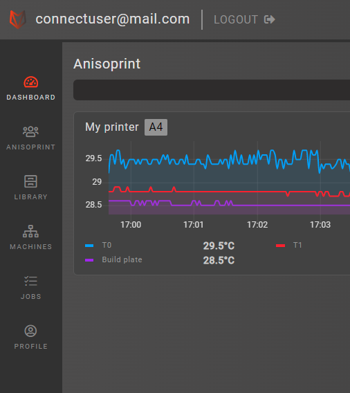
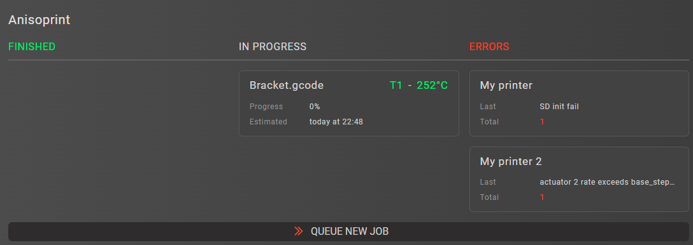
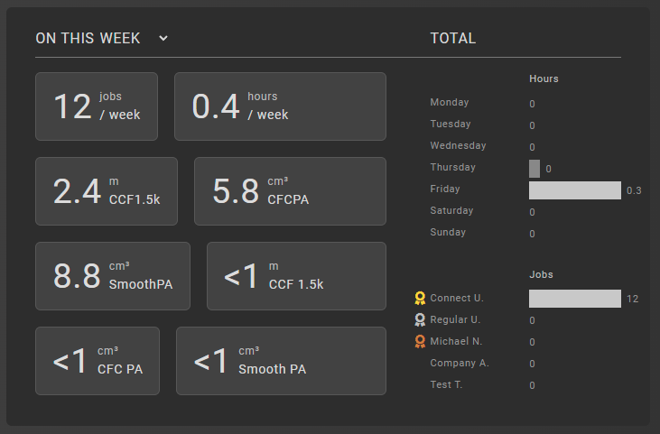
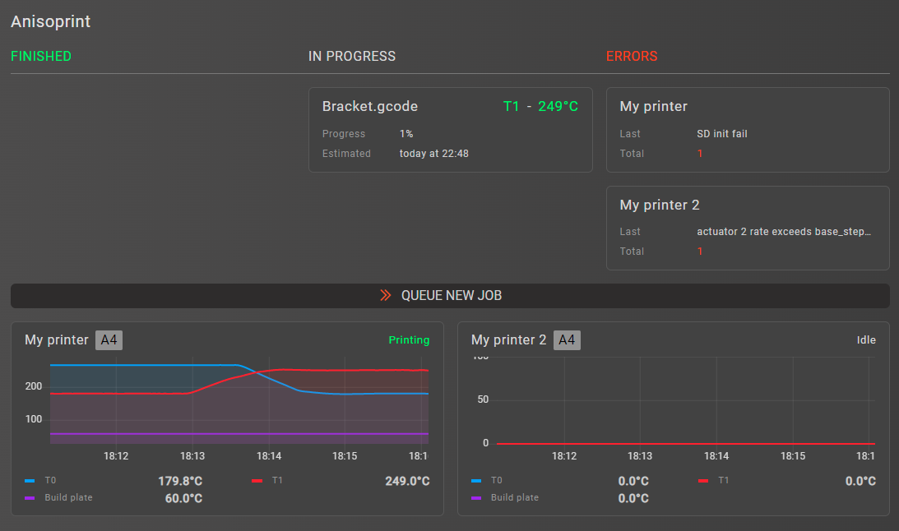
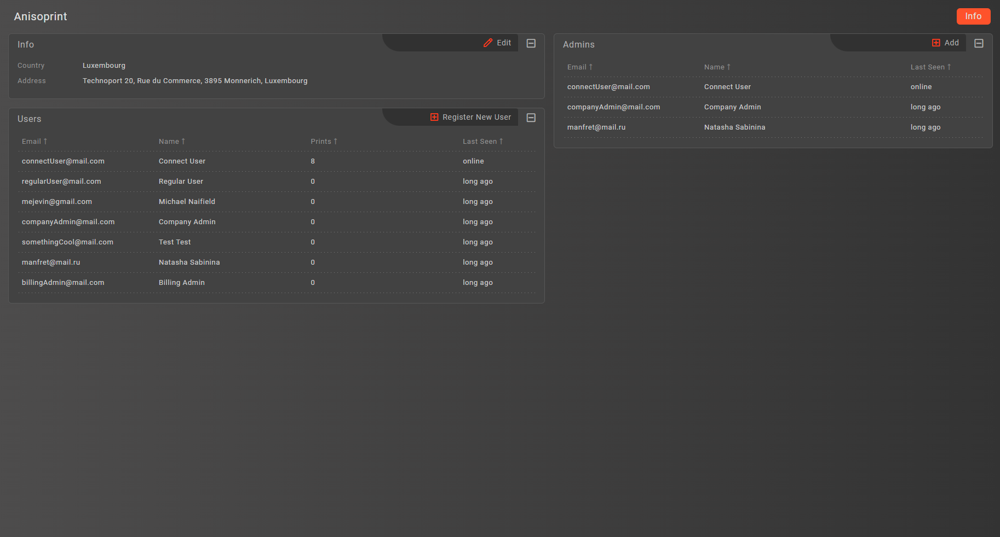

# GUI overview

This document will show and explain all parts of the user interface offered by Aura.Connect

## Login

The very first part of the user interface that every new user of Aura.Connect will see is the [Login](#login) screen

Although this UI element may be self explanitory, let's still go through its main parts 

### Sign in

The sign in screen allows you to perform authentication using your Aura.Connect credentials

In order to authenticate enter your email in the first field and your password in the second field, then click the **'Sign In'** button

### Forgot password

On the [Sign in](#sign-in) screen, there is the **'Forgot password'** button, which brings you to the forgot password screen, which looks like this

Here you will be able to reset your password, if you happen to forget it. All you need to do is enter your email in the field, then click the **'Send'** button

Shortly after you will receive a password recovery code on your email, which you can use to set a new password for your account in Aura.Connect

::: warning
Password recovery codes can expire. If your recovery code has expired, you can request a new one by following instruction above
:::

## Navbar

The static upper part of Aura.Connect is called a [Navbar](#navbar). Here you will be able to see your accounts' email, and logout.

### Logout

In order to logout click the **'Logout'** button, which is located after your email in the [Navbar](#navbar)

## Sidebar

The static left hand side part of Aura.Connect is called a [Sidebar](#sidebar). It contains all of the sections of Aura.Connect, which are available to your account

::: tip
Different account types in Aura.Connect have different section of Aura.Connect available to them. See [Account types]() for more information
:::

Let's go over each of the sections in more detail below

## Dashboard

Navigate to the [Dashboard](#dashboard) by clicking the **'Dashboard'** button located in the [Sidebar](#sidebar)

The dashboard section is often used as a quick summary of your company's statistics and for monitoring the current state of your printers. 

Dashboard is split into three main parts, listed below

### Printer summary

Shows the current state of printers added to your company is Aura.Connect. There are 3 groups the printers are split into, they include:

1. Finished
    - Shows all the printers that have finished printing and need a confirmation from the user on their screen
2. In progress
    - Shows all the printer that are currently printing
    - For each printing printer you will see
        1. G-Code file name, that's currently being printer
        2. Overall printing progress in percents, ranging from 0% to 100%
        3. Current tool being used by the printer, and that tools' temperature
3. Errors
    - Shows all the printes that have unacknowledged errors, and the last error that the printer has sent out

### Printer telemetry summary

Is consisted of printer cards, each printer card shows:

1. Telemetry data over the last 5 minutes (for connected printers only)
2. Printer state in the upper right corner 
3. Printer name
4. Printer model

::: tip
You can hover your mouse cursor over the plotting area in order to study telemetry data in more detail
:::

### Company statistics summary

Shows a quick summary of statistics in your company. These statistics include:

1. Statistics for a period
    1. Jobs finished
    2. Print hours
    3. Material consumptions for each material

2. Statistics overall
    1. Printing hours by weekday
    2. Jobs by user

Additionally, you can queue a new printing job using the [Job queue wizard]() by clicking the **'Queue new job'** button

> If you haven't added any printers in Aura.Connect yet, you will see a **'Add new machine'** button instead of the **'Queue new job'** button

## Company

Navigate to the [Company](#company) by clicking the **'Company'** button located in the [Sidebar](#sidebar)

The company section contains information about all the users in the company. If you're a company admin you are also able to change information about the company, add new users, add other users to company admins.

This section is split into three main parts listed below

### Info panel

In the upper left part you will see the [Info](#info-panel) panel

Here you will be able to see your company's 

### Users panel

In the lower left part you will see the [Users](#users-panel) panel

### Admins panel

In the upper right part you will see the [Admins](#admins-panel) panel

### Info edit form

In order to edit company information press the **'Edit'** button in the [Info](#info-panel) panel

Press the **'Apply'** button after you've finished editing your company's information, this will save all of your changes to Aura.Connect

Press the **'Reset'** button if you wish to revert all the changes made to your company's information

Press the **'Cancel'** button or a close button in the top right corner of the form to close the form  

### New user form

In order to add a new user to your copmpany press the **'Register new user'** button in the [Users](#users-panel)

### New admin dialog

In order to add a new admin to your company press the **'Add'** button in the [Admins](#admins-panel) panel

## Library

## Machines

## Jobs

## Profile