# Quickstart

This document will show and explain basic functionality of Aura.Connect

To follow this quickstart guide, you have to have an account in Aura.Connect with **Connect User** and **Company Admin** privileges. See [Getting an account](/aura-connect/getting-an-account/) [Account types](/aura-connect/getting-an-account/#account-types) and [Requesting privileges](/aura-connect/getting-an-account/#requesting-privileges) for more information

## Login

When you navigate to [Aura.Connect](https://aura3d.tech) for the first time, you will see the [Login](/aura-connect/gui/#login) screen.

Use your accounts credentials to login

After a successful login you will see the [Dashboard](/aura-connect/gui/#dashboard)

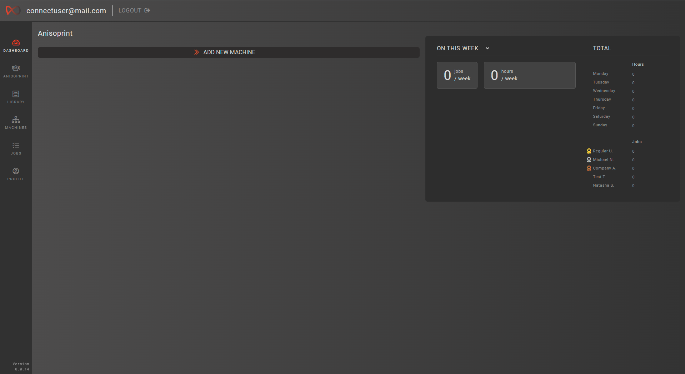

> Your Dashboard will look different if other users in your company have already added printers

## Adding a printer

::: tip
Before connecting your printer to Aura.Connect make sure it has network capabilities, compatible firmware and is connected to the internet. For more information see [Compatible hardware and printer firmware](/aura-connect/before-you-start/#compatible-hardware-and-printer-firmware) and [Wi-Fi Connection](https://support.anisoprint.com/composer/manual/#wi-fi-connection)
:::

One of the things Aura.Connect does, is it helps you to remotely operate and monitor printers owned by your company. For that, Aura.Connect needs to be linked to your physcial printers. 

To connect a physical printer to Aura.Connect, follow the instructions below

1. Navigate to the [Machines](/aura-connect/gui/#machines) screen by clicking on the **'Machines'** button in the [Sidebar](/aura-connect/gui/#sidebar)

    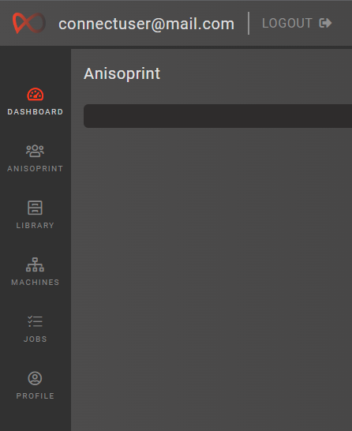

    > While at the Dashboard screen, if no printers were added in Aura.Connect by your company, you can click the **'Add new machine'** button, which will redirect you to the Machines screen

2. Click on the **'Add new machine'** button [1] in the top left and you will see a [Machine creation form](/aura-connect/gui/#add-new-printer) [2] appear in the bottom left

    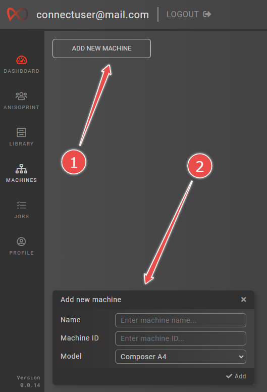

3. In the form, enter the name of your printer, select its model, and enter its [Machine ID](/aura-connect/terminology/#machine-id)

    - To find out your printers MachineID, on its screen press on **Maintenance** -> **Netowrk** -> **Aura.Connect**. You should now be able to see your printer's Machine ID

        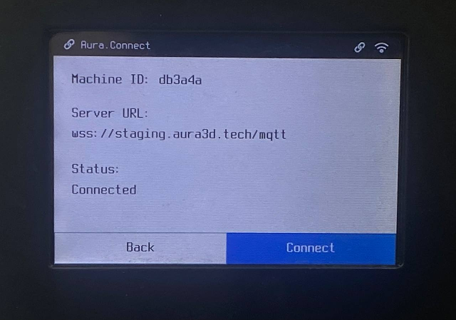

4. Click the **'Add'** button in the bottom right corner of the form

    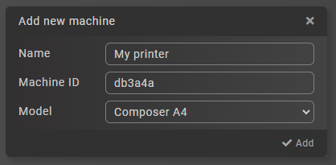

5. After some time, your printer will be successfuly added to Aura.Connect and you will be presented with a [Connection Code](/aura-connect/terminology/#connection-code) which you may use to connect your printer to Aura.Connect

    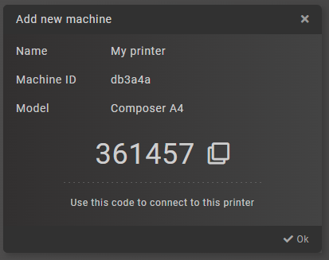

6. On your physical printer's screen press on **Maintenance** -> **Netowrk** -> **Aura.Connect** -> **Connect**.

    1. Enter ***wss://aura3d.tech/mqtt*** in the **Server URL** field
    2. Enter the connection code from step 5 in the **Security code** field
    3. Press **Connect**

If all the points above have been completed successfully, you will be able to see the newly added printer in **Idle** status

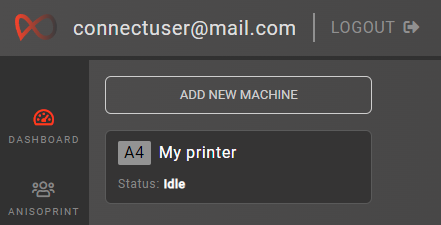
 
## Uploading print files

Aura.Connect allows you to remotely queue [print jobs](/aura-connect/terminology/#jobs) for your printers. For that you need to upload .gcode (and optionally .auprojx) files into your company's file library. 

To upload print files, follow the instruction below

1. Navigate to the [Library](/aura-connect/gui/#library) screen by clicking on the **'Library'** button in the [Sidebar](/aura-connect/gui/#sidebar)

    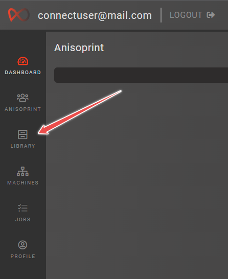

2. Click on the **'Add new file'** button [1] and you will see a [File upload form](/aura-connect/gui/#add-file-form) [2] appear.

    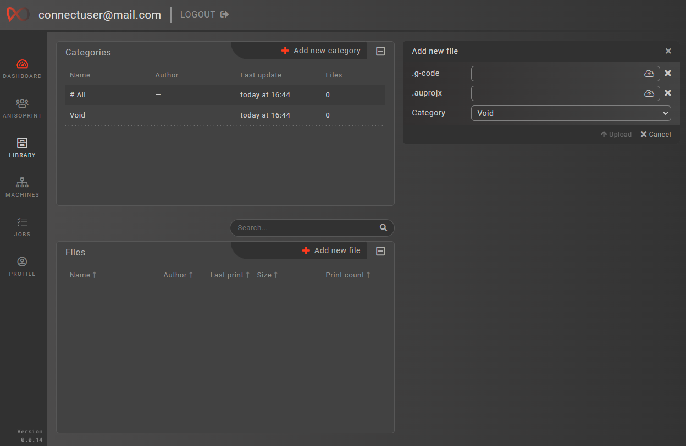

3. Drag and drop the desired .gcode file into the **.g-code** field.

4. Optionally drag and drop .auprojx file into the **.auprojx** field

> Alternatively you can click on the cloud icon to browse for files on your PC

5. Click on the **'Upload'** button.

After some time you will see a new row [1] appear in the [Files](/aura-connect/gui/#files-panel) area. You can inspect the uploaded files by clicking on the newly created row. [File inspector](/aura-connect/gui/#file-inspector) [2] will apear on the right

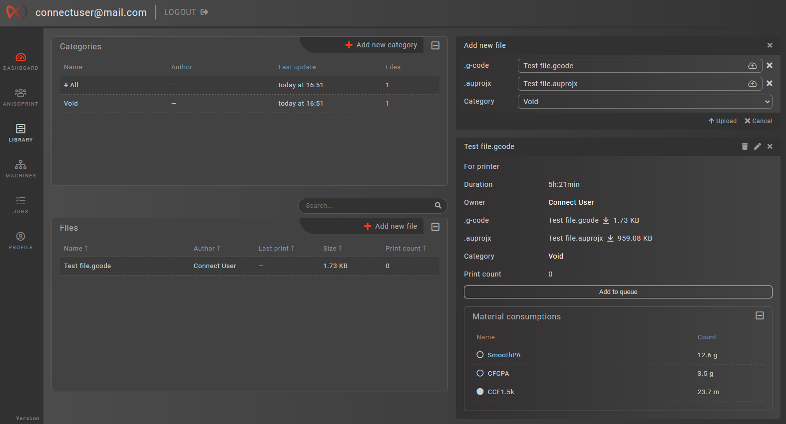

If all the points above were successfully completed, the files that you selected are uploaded to Aura.Connect and are ready to be used. 

## Queuing a print job

::: warning
All queued jobs require the user to manually start them
:::

At this point, Aura.Connect is connected to a physcial printer and is ready to queue jobs containing .gcode files onto that printer. 

To queue a job, follow the instructions below

1. Navigate to the [Jobs](/aura-connect/gui/#jobs) screen by clicking on the **'Jobs'** button in the [Sidebar](/aura-connect/gui/#sidebar)

    

2. Click on the **'Queue new job'** button and you will see a [Job queue wizard](/aura-connect/gui/#queue-a-new-job) dialog window appear.

    

3. In the dialog window, select the printer we added earlier, then select a file that we also added previously, click **'Confirm'**. A new job in the left hand side will appear.

    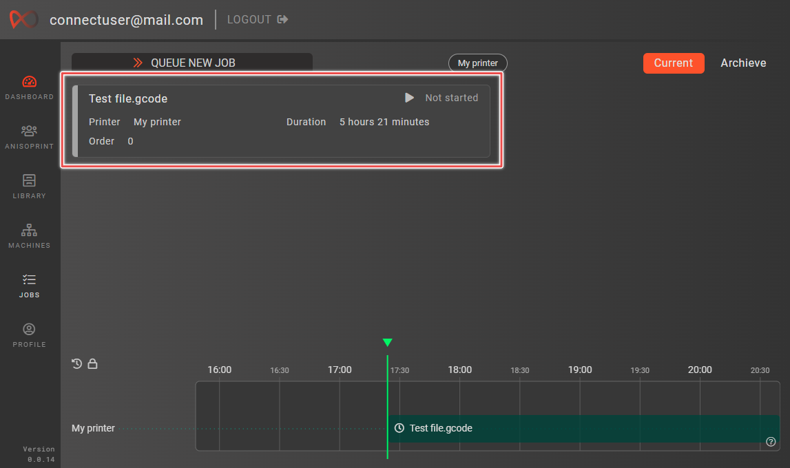

If steps above were completed successfully, a new job contatining .gcode in the selected file has just been queued onto a printer of your choice.

You can queue more jobs, as needed. Or click on the [Job card](/aura-connect/gui/#job-cards) [1] on the left to inspect it. You will see a [Job inspector](/aura-connect/gui/#job-inspector) [2] appear on the right

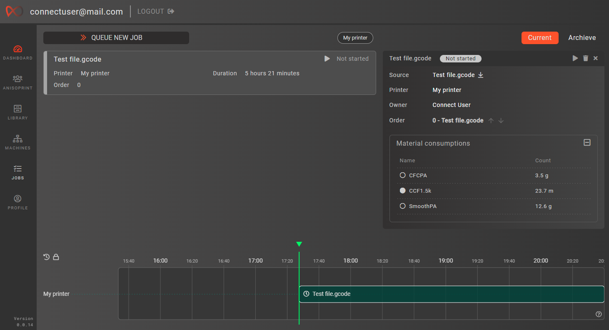

> You may also use the [Job Timeline](/aura-connect/gui/#job-timeline) to select a queued job for inspection

## Starting a print job

::: warning
Before starting a job make sure that your printer is supplied with all the necessary materials required to perform a print. Refer to [Loading materials](https://support.anisoprint.com/composer/manual/#loading-materials-2) and [Test print](https://support.anisoprint.com/composer/manual/#loading-materials-2) for more information
:::

So far, we've added a printer, uploaded a file, and queued a job. The job is now ready to be started. 

There are two ways you can do that, which are described below. 

### From the printer

Once the job has been queued onto the printer, you will see **'Aura.Connect Job awaiting'** button appear on its screen, go ahead and press it

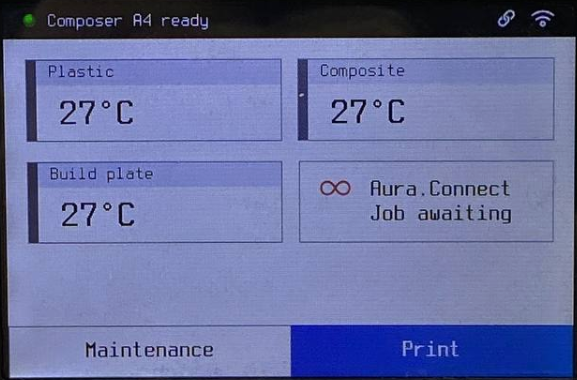

You will see a screen containing information about the job, including:

1. Print time
2. Material consumptions for the print
3. Name of .gcode file that will be executed

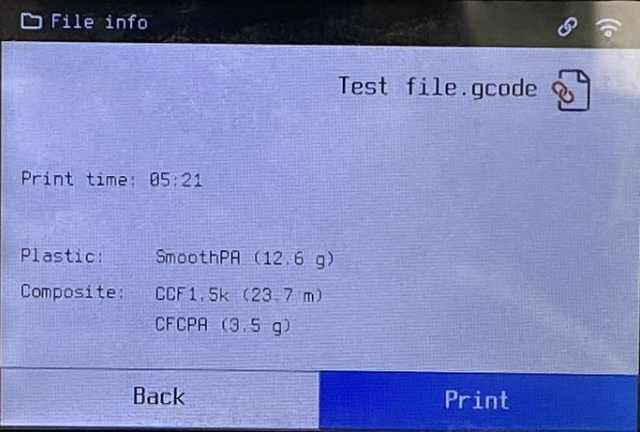

To start the job, press **'Print'**

### From Aura.Connect

To start the job **from Aura.Connect**, we need to click on the start buttons either in the [Job Card](/aura-connect/gui/#job-cards) [1] or [Job Inspector](/aura-connect/gui/#job-inspector) [2]

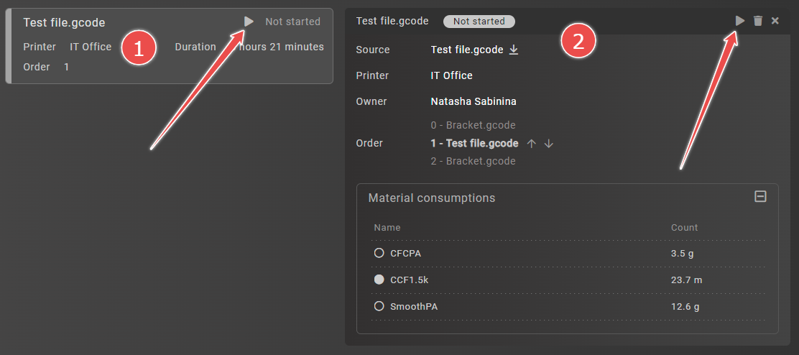

---

Job start process includes the transfer of a .gcode file contained in the job to the printer to which the job has been assigned to.

After the file has been successfully transfered, you will see the user interface update accordingly in Aura.Connect and on the printer

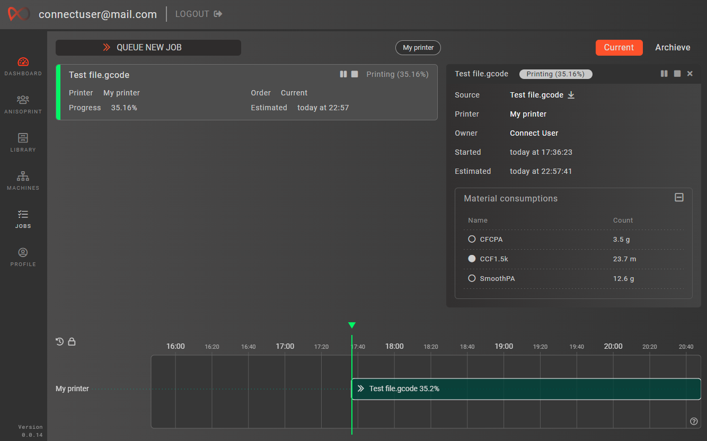
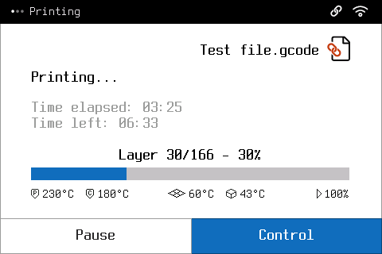

## Monitoring a print job

Now that the job is started you can either monitor its progress in the [Jobs](/aura-connect/gui/#jobs) screen or the [Dashboard](/aura-connect/gui/#dashboard) screen

## Finishing a print job

After the print is finished you must confirm it on the printer screen. Press the **'OK'** button at the bottom of the screen

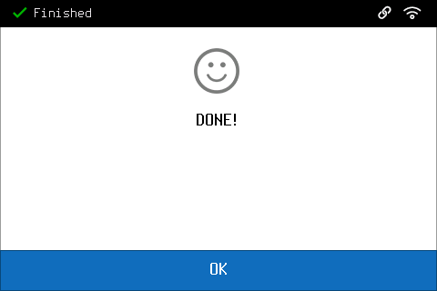

::: danger
Before pressing the **'OK'** button make sure that you remove the printed part from the printer's buildplate. When you press **'OK'** the printer goes to the **'Idle'** state, indicating that the next job can be printed.

See [Not removing printed parts before subsequent prints](/aura-connect/before-you-start/#not-removing-printed-parts-before-subsequent-prints) for more information 
:::

## Accumulating statistics

After the job is finished, statistic of its material consumptions and duration will be accumulated in Aura.Connect. You can view these statistics in the [Dashboard](/aura-connect/gui/#dashboard) screen or in the [Profile](/aura-connect/gui/#profile) screen

