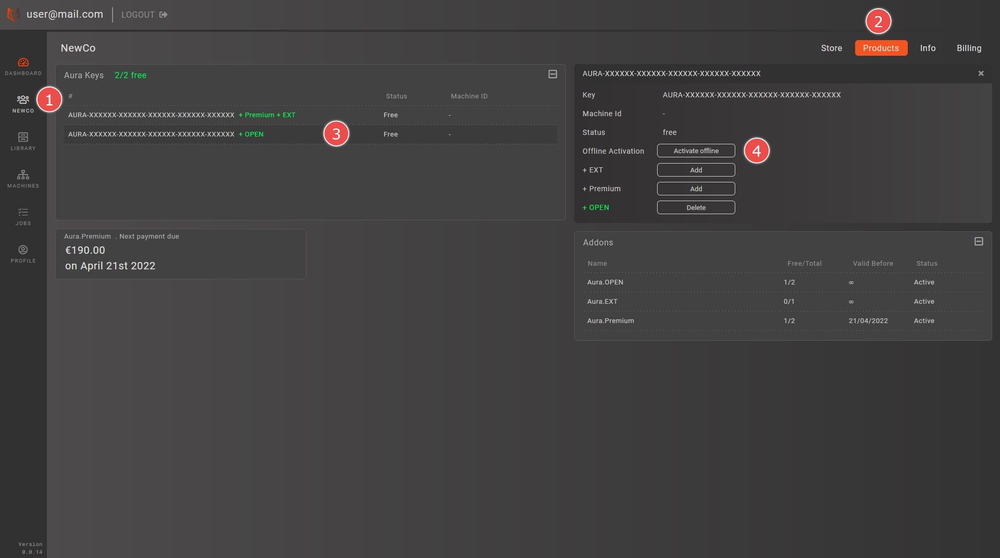

# Product Activation
## Activation

To activate your Aura license, open **Help > License information** dialog from the main menu.

After that, click **Activate license** button. 

If your PC is connected to the internet, the best option is to use an **Online** activation. Enter your serial key and click **Activate license** button.

The **Offline** activation is also possible if your PC doesn't have an internet connection. The offline activation procedure is the following:
1. Enter the license key
2. Click "Get request file" and save the activation request file
3. Using a PC with internet connection login to your Aura.Connect account at [aura3d.tech](https://aura3d.tech). 
4. Go to your company page [1] and select the Products tab [2].
5. Click on the license key that you are activating [3].
6. Click the 'Activate offline' button on the key details panel [4].
7. In the appeared dialog window upload the activation request file from step 2.
8. Download the activation response file.
9. Open the response file from step 8 in Aura by clicking 'Open response file'.

::: tip NOTE
If you do not have Aura.Connect account, please check [Getting an account](/aura-connect/getting-an-account/). Alternatively, you can send the request file and the last 6 symbols of your license key to [support@anisoprint.com](mailto:support@anisoprint.com)
:::

## Deactivation

You can deactivate your license to transder it to a different PC. This can be done using **Help > License information** dialog from the main menu.

To deactivate license click the **Deactivate** button. Either **Online** or **Offline** deactivation methods are possible.

**Online** deactivation is performed automatically. The procedure for **Offline** deactivation is the following:
1. Click "Get request file" and save the deactivation request file
2. Using a PC with internet connection login to your Aura.Connect account at [aura3d.tech](https://aura3d.tech). 
3. Go to your company page and select the Products tab.
5. Click on the license key that you are activating.
6. Click the 'Manage' button near the 'Offline actication' caption on the key details panel.
7. In the appeared dialog window upload the deactivation request file from step 1.

::: tip NOTE
If you do not have Aura.Connect account, please check [Getting an account](/aura-connect/getting-an-account/). Alternatively, you can send the request file and the last 6 symbols of your license key to [support@anisoprint.com](mailto:support@anisoprint.com)
:::